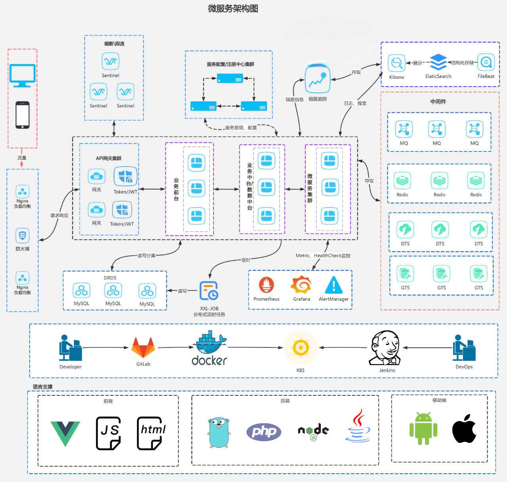
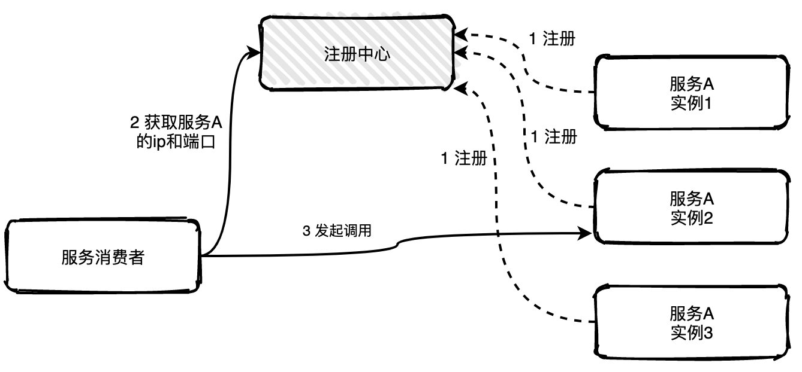

## 先聊聊单体架构吧

在一个项目的最初阶段，只有几个人参与的时候，想着业务能够快速迭代，往往采用单体应用的架构。求快，因此会把不同功能模块耦合在一起，编译打包部署也都在一起。

但是当业务规不断扩大，团队规模不断扩大，问题就慢慢暴露出来了。代码的高耦合，很难进行高效的横向扩展、每次部署上线都要重新部署整个应用、CI/CD和测试也逐渐变得更加耗时且容易因为一个很小的问题就失败...

于是团队为了解决这些问题，做了很细致的技术调研，最后选定了服务化的解决方案，对原有的单体应用架构进行改造，把功能相对独立的模块拆分出去，部署为微服务，分别交给专门的更小的团队来维护。后来我们又引入了Docker容器化，以及Service Mesh等技术，为了更好地适应业务的高速发展。

这就是应用架构经历了经历了单体应用 - 微服务架构 - 容器化应用 - DevOps的发展历程

## 微服务化拆分

因此当团队出现上述类似的问题时，往往就该考虑将单体架构应用进行拆分。

拆分往往分为横向拆分和纵向拆分

- 纵向：是从业务维度进行拆分。标准是按照业务的关联程度来决定，关联比较密切的业务适合拆分为一个微服务，而功能相对比较独立的业务适合单独拆分为一个微服务

- 横向：是从公共且独立功能维度拆分。标准是按照是否有公共的被多个其他服务调用，且依赖的资源独立不与其他业务耦合

但同时从单体架构向微服务的迁移会暴露出更多的问题

- 服务如何定义

- 服务如何发布和订阅

- 服务如何监控

- 服务如何治理

- 故障如何定位

## 微服务架构



总结一下，微服务架构下，服务调用主要依赖下面几个基本组件：

服务描述

注册中心

服务框架

服务监控与追踪

服务治理

### 服务描述

服务如何对外描述就是当我们对外提供一个服务，服务的服务名叫什么？调用这个服务需要提供哪些信息？调用这个服务返回的结果是什么格式的？该如何解析？

常见的一般是RESTful API，IDL文件等等。前者往往是基于HTTP，可以通过Wiki或者Swagger来管理。后者往往基于RPC，通过IDL文件管理

```proto
service ProductCatalogService {
  rpc AddProduct(AddProductReq) returns (AddProductResp) {}
  rpc UpdateProduct(UpdateProductReq) returns (UpdateProductResp) {}
  rpc DeleteProduct(DeleteProductReq) returns (DeleteProductResp) {}
  rpc OnlineProduct(OnlineProductReq) returns (OnlineProductResp) {}
  rpc OfflineProduct(OfflineProductReq) returns (OfflineProductResp) {}
  rpc ListProducts(ListProductsReq) returns (ListProductsResp) {}
  rpc GetProduct(GetProductReq) returns (GetProductResp) {}
  rpc BatchGetProducts(BatchGetProductsReq) returns (BatchGetProductsResp) {}
  rpc SearchProducts(SearchProductsReq) returns (SearchProductsResp) {}
  rpc GetCategories(GetCategoriesReq) returns (GetCategoriesResp) {}
  rpc GetCategory(GetCategoryReq) returns (GetCategoryResp) {}
  rpc DecrStock(DecrStockReq) returns (DecrStockResp) {}
  rpc IncrStock(IncrStockReq) returns (IncrStockResp) {}
}
```

### 注册中心

提供了一个服务，如何让外部想调用你的服务的人知道。这个时候就需要一个类似注册中心的角色，服务提供者将自己提供的服务以及地址登记到注册中心，服务消费者则从注册中心查询所需要调用的服务的地址，然后发起请求



### 服务框架

框架设计到的东西有很多，但基本的是保障服务间的调用

- 服务通信采用什么协议？就是说服务提供者和服务消费者之间以什么样的协议进行网络通信，是采用四层TCP、UDP协议，还是采用七层HTTP协议，还是采用其他协议？

- 数据传输采用什么方式？就是说服务提供者和服务消费者之间的数据传输采用哪种方式，是同步还是异步，是在单连接上传输，还是多路复用

- 数据压缩采用什么格式？通常数据传输都会对数据进行压缩，来减少网络传输的数据量，从而减少带宽消耗和网络传输时间，比如常见的JSON序列化、Java对象序列化以及Protobuf序列化等

### 服务监控与追踪

- 指标收集。就是要把每一次服务调用的请求耗时以及成功与否收集起来，并上传到集中的数据处理中

- 数据处理。有了每次调用的请求耗时以及成功与否等信息，就可以计算每秒服务请求量、平均耗时以及成功率等指标

- 数据展示。数据收集起来，经过处理之后，还需要以友好的方式对外展示，才能发挥价值。通常都是将数据展示在Dashboard面板上，并且自动刷新，用作业务监控和报警等

- 链路追踪，记录服务调用经过的每一层链路，以便进行问题追踪和故障定位。常使用requestId或者traces的方式

### 服务治理

服务治理就是通过一系列的手段来保证在各种意外情况下，服务调用仍然能够正常进行。这部分往往需要框架做一些支持

- 单机故障。通常遇到单机故障，都是靠运维发现并重启服务或者从线上摘除故障节点。然而集群的规模越大，越是容易遇到单机故障，在机器规模超过一百台以上时，靠传统的人肉运维显然难以应对。而服务治理可以通过一定的策略，自动摘除故障节点，不需要人为干预，就能保证单机故障不会影响业务。

- 单IDC故障。你应该经常听说某某App，因为施工挖断光缆导致大批量用户无法使用的严重故障。而服务治理可以通过自动切换故障IDC的流量到其他正常IDC，可以避免因为单IDC故障引起的大批量业务受影响。

- 依赖服务不可用。比如你的服务依赖依赖了另一个服务，当另一个服务出现问题时，会拖慢甚至拖垮你的服务。而服务治理可以通过熔断，在依赖服务异常的情况下，一段时期内停止发起调用而直接返回。这样一方面保证了服务消费者能够不被拖垮，另一方面也给服务提供者减少压力，使其能够尽快恢复。

## 写在最后

作为学习，大家可以去尝试微服务的架构，但在生产环节不要为了微服务而微服务，生产环节一定要考虑需求与开发与资源成本。

贴几个项目

https://github.com/NJUPT-SAST/sastoj

https://github.com/Vigor-Team/youthcamp-2025-mall-be
