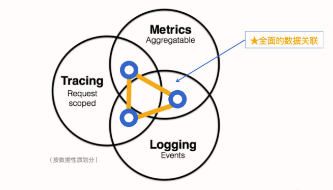
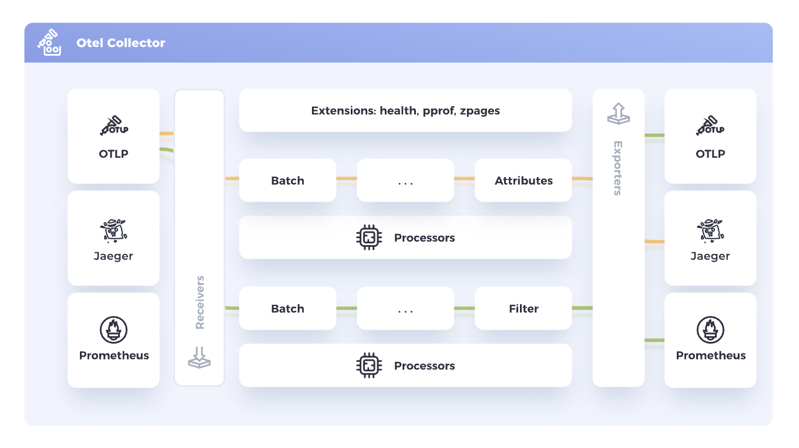
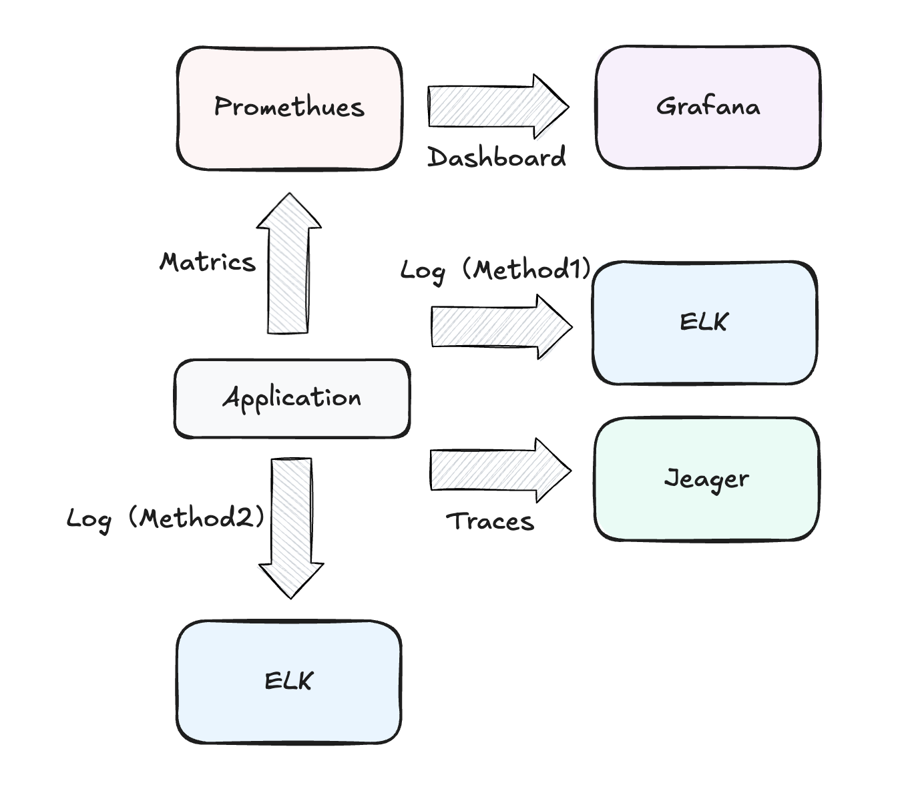
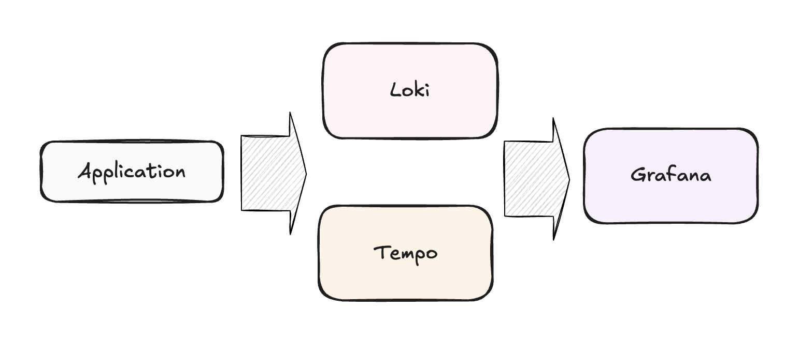

## 可观测性

### 什么是可观测性？

>马克·安德森（Marc Andreessen）说过这样一句话：“软件正在吞噬世界 ”。这句话发表于2011年，但是十多年后的今天，我想它更好的演绎应该是“云原生正在吞噬世界，万物皆可上云”。面对云原生这个新赛道，BAT、美团、字节跳动、快手等一线大厂都在加速推进业务的容器化、云原生化。

> 也正是由于各大厂商对云原生的奔赴，传统的技术架构面临着巨大的冲击，我们的监控对象也由传统的单体结构，变成了分布式的多个微服务。监控，被架到了一个不得不革自己命的位置。在这样的背景之下，可观测性（Observability）脱颖而出。

> CNCF 早在定义云原生的概念时就提到了可观测性 ，它声称可观测性是云原生时代的必备能力。而随着可观测性的概念明晰化，相关产品纷纷涌现，“可观测性”越来越成为云原生一个绕不开的话题。

在计算机系统和软件领域，可观测性的含义：它可以从系统和应用对外输出的信息（包括你可能已经知道的指标、日志和链路），来帮助我们了解应用程序的内部系统状态和运行情况。



**可观测性能够架起开发人员和运维人员构建合作的桥梁**，运维人员使用可观测性来发现问题，给故障现场提供足够的数据让开发人员进行分析，而开发人员可以使用可观测性来指导运维人员定位问题，并使用工具来质疑和验证假设；

从单机电脑时代的Windows任务管理器，Linux一堆Top、PS等命令帮助我们知道操作系统的运行转台；再到局域网时代的C/S架构、互联网时代的B/S架构的网络监控工具；再到如今移动互联网时代，出现了大量的可观测性技术。ELK方案、基于时序数据库的监控软件（如Prometheus、Telegraf + InfluxDB 等，APM 则出现了 ZipKin、Jaeger、Pinpoint、Skywalking 这些软件）然而，如果我们要完整地“观测”一个互联网系统，还是需要将各种形态的开源监控产品组合起来使用。

OpenTelemetry 这个组织的出现标志着业界意识的产生，也就是，我们需要将系统的可观测性变成一种统一的标准和规范。OpenTelemetry 致力于推动更多的应用和服务遵循这一规范，同时也会提供相应的可观测性能力。这也是我们今天这节课的重点

**Metrics**

指标 是对一段时间内基础设施或应用程序的数值数据的汇总。由于指标最大的特点是聚合性，它生成的数值反映了预定义时间段内系统状态的汇总报告，在此期间处于活动状态的所有请求的行为都会汇总为一个数值，因此缺乏细颗粒度。同时这些指标很可能都是彼此不相关的，没有关联性。

**Log**

日志 是一种带时间戳的文本记录，可以是结构化，也可以是非结构化的。

结构化日志
```json
{
  "timestamp": "2024-08-04T12:34:56.789Z",
  "level": "INFO",
  "service": "user-authentication",
  "environment": "production",
  "message": "User login successful",
  "context": {
    "userId": "12345",
    "username": "johndoe",
    "ipAddress": "192.168.1.1",
    "userAgent": "Mozilla/5.0 (Windows NT 10.0; Win64; x64) AppleWebKit/537.36 (KHTML, like Gecko) Chrome/104.0.0.0 Safari/537.36"
  },
  "transactionId": "abcd-efgh-ijkl-mnop",
  "duration": 200,
  "request": {
    "method": "POST",
    "url": "/api/v1/login",
    "headers": {
      "Content-Type": "application/json",
      "Accept": "application/json"
    },
    "body": {
      "username": "johndoe",
      "password": "******"
    }
  },
  "response": {
    "statusCode": 200,
    "body": {
      "success": true,
      "token": "jwt-token-here"
    }
  }
}
```

非结构化日志
```txt
[ERROR] 2024-08-04 12:45:23 - Failed to connect to database. Exception: java.sql.SQLException: Timeout expired. Attempted reconnect 3 times. Server: db.example.com, Port: 5432

System reboot initiated at 2024-08-04 03:00:00 by user: admin. Reason: Scheduled maintenance. Services stopped: web-server, database, cache. Estimated downtime: 15 minutes.

DEBUG - 2024-08-04 09:30:15 - User johndoe performed action: file_upload. Filename: report_Q3_2024.pdf, Size: 2.3 MB, Duration: 5.2 seconds. Result: Success
```

**Trace** 

链路 是请求经过应用程序的路径。可以从一个宏观的角度看到请求在应用内的路径。链路追踪检测的主要问题是，如果仅靠开发人员“插桩”（英文 Instrument，有些地方也翻译成埋点，是指将有关系统状态的数据发送到监测系统）他们的代码是不够的。大量应用程序是使用可能需要额外工具的开源框架或库构建的。这在多语言架构的地方变得更加具有挑战性，因为要考虑到每种语言、框架和协议的不同。同时，增加插桩的成本也是比较高的，很难真正做到全面覆盖。另一方面大量的插桩也会占用比较高的计算资源。

### OpenTelementry

https://opentelemetry.io/docs/what-is-opentelemetry/

OpenTelemetry 简称 OTel， 是 CNCF （ Cloud Native Computing Foundation，云原生计算基金会，是一个开源软件基金会，致力于云原生技术的普及和可持续发展） 的一个可观测性项目。

OpenTelemetry 旨在提供可观测性领域的标准化方案，解决遥测数据的数据建模、采集、处理、导出等标准化问题，并能够将这些数据发送到你选择的后端（开源或商业均可）。这样你就可以建立不被供应商锁定的可观测，灵活地更改后端，不需要再次更改代码，重新进行插桩（Instrument）了

OpenTelemetry 不是凭空出现的。在 OpenTelemetry 出现之前，还出现过 OpenTracing 和 OpenCensus 两套标准。

#### OTel 架构

- 跨语言实现（Specification）
- API/SDK
- 接受、转换和导出遥测数据的工具（Opentelemetry Collector）

**跨语言规范**

跨语言规范描述了所有实现的跨语言要求和数据模型，包括遥测客户端内部实现所需要的标准和定义，也包含与外部通信时需要实现的协议规范。跨语言规范主要包含了下面几类。

- API：定义用于生成和关联追踪、指标和日志的数据类型和操作。
- SDK：定义 API 特定语言实现的要求，同时还定义配置、数据处理和导出等概念。
- 数据：定义遥测后端可以提供支持的 OpenTelemetry 协议 （OTLP） 和与供应商无关的语义约定。

这里要重点说一下这个 OTLP 协议，它的全称是 OpenTelemetry Protocol，它是 OpenTelemetry 原生的遥测信号传递协议，虽然 OpenTelemetry 项目组件支持了Zipkin v2 或 Jaeger Thrift 协议格式的实现，但这种支持都是以第三方贡献库的形式提供的。只有 OTLP 是 OpenTelemetry 官方原生支持的格式。OTLP 的数据模型定义是基于 ProtoBuf 完成的，如果你需要实现一套可以收集 OTLP 遥测数据的后端服务，那就需要了解里面的内容（可以参考代码仓库 [opentelemetry-proto](https://github.com/open-telemetry/opentelemetry-proto)）。

**API / SDK**

API 可以让开发者对应用程序代码进行插桩（Instrument），而 SDK 是 API 的具体实现，是和开发语言相关的。

https://opentelemetry.io/docs/concepts/instrumentation/

主要有两种方式实现插桩
- Code-based solutions via official APIs and SDKs for most languages
- Zero-code solutions

前者是使用OTel API为你的应用手动插桩监控，是零代码解决方案的重要补充
后者则是使用OTel为各种语言和库开发的SDK、OpenTelemetry 公共组件的设计模式或语言特性等来降低使用门槛。

**OpenTelemetry Collector**

Collector应该是OTel架构中最重要的部分

https://opentelemetry.io/docs/collector/

> Vendor-agnostic way to receive, process and export telemetry data.

Collector 针对如何接收、处理和导出遥测数据提供了与供应商无关的实现，消除了运行、操作和维护多个代理/收集器的需要，它支持将开源可观测性数据格式（例如 Jaeger、Prometheus 等）发送到一个或多个开源或商业后端。

在 Collector 的内部，有一套负责接收、处理和导出数据的流程被称为 Pipeline。 每个 Pipeline 由下面三部分组件组合而成。



- Receiever: 负责按照对应的协议格式监听和接收遥测数据，并把数据转给一个或多个Processor
- Processor：负责加工处理遥测数据，如丢弃数据，增加信息，转发处理等，并把数据传递给下一个Processor或者一个或多个Exporter
- Exporter：负责把数据传递给下一个接收端，比如将指标数据存储在Prometheus中

**部署角度**

从部署的角度而言，Collector有下面两种模式

- **第一种模式可以统称为Agent模式。** 它是把 Collector 部署在应用程序所在的主机内部（在 Kubernetes 环境中，可以使用 DaemonSet），或者在 K8s 环境中通过边车（Sidecar）的方式部署。这样，应用采集到的遥测数据可以直接传递给 Collector。

- **第二种是Gateway模式。** 它把 Collector 当作一个独立的中间件，应用会把采集到的遥测数据往这个中间件里传递。

#### OTel技术方案

针对 OTel 有很多不同的技术实现方案，我们可以分别了解一下

**OTel to 开源工具组合**

https://docs.guance.com/best-practices/cloud-native/opentelemetry-elk/

作为经典的遥测数据的处理架构，我们可以使用不同的开源工具将不同的遥测数据存储在不同的平台。比如log我们可以存储在ELK中，traces我们可以存储在Jeager中，而matrics可以保存在Promethues中并通过Grafana展示



**OTel to Grafana**

https://docs.guance.com/best-practices/cloud-native/opentelemetry-grafana/

随着 Grafana 进军可观测行业，Grafana的 Tempo 和 Loki 逐渐被很多人使用

- Grafana Tempo 一个开源易使用且大规模的分布式链路追踪后端。不依赖数据库或搜索引擎（如 Elasticsearch），直接把 trace 存到对象存储（比如 S3/MinIO），可横向扩展，超高性价比。

- Loki 是 Grafana Labs 团队最新的开源项目，是一个水平可扩展，高可用性，多租户的日志聚合系统。相比于ELK的日志处理方案，Loki的设计是十分经济高效的，并不会建立全文索引，而是对数据进行Tag标注，类似于 Promethues，官方给的介绍就是 “Like Prometheus, but for logs”，非常适合云原生的场景。常常搭配 Promtail 使用。



**OTel to 观测云平台**

阿里云、腾讯云、观测云等国内的云平台都提供了云可观测的解决方案，像国外也有ELK Stack、AWS CloudWatch、Grafana Labs等  


