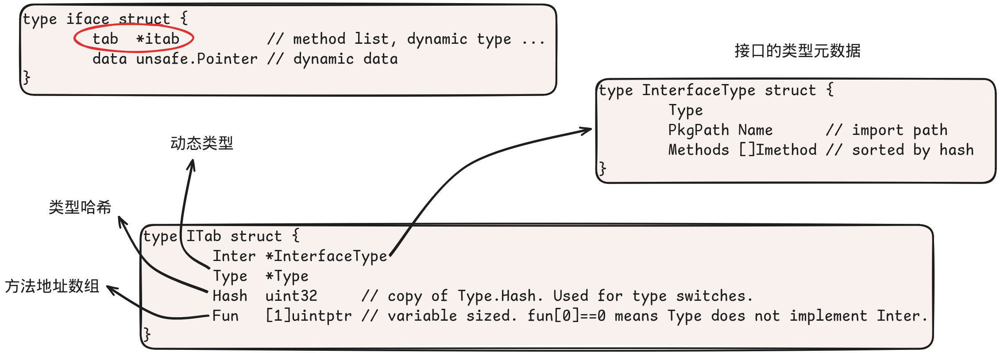

编译阶段有变量、类型、方法等，那在运行阶段反射、接口、类型断言这些语言特性或机制是怎么动态的获取数据类型信息呢？今天我们就来聊聊这些问题吧😀

## 类型系统

首先我们要知道在Go中，这些属于内置类型：
```
bool
int(32 or 64), int8, int16, int32, int64
uint(32 or 64), uint8(byte), uint16, uint32, uint64
float32, float64
string
complex64, complex128
array    -- 固定长度的数组
slice   -- 序列数组
map     -- 映射
chan    -- 管道
```
当然还有自定义类型，比如：
```go

// custom type based on int
type T int 
// that is different from the one below
// type T = int
// that just a alias for T, it's type is still int


// struct
type T struct {
	name string	
}

// interface
type T interface {
	Name() string
}
```
Go不允许为内置类型添加方法，同时接口类型是无效的方法接收者。

数据类型虽然多，但是无论是内置类型还是自定义类型，都有对应的类型描述信息，称之为**类型元数据**，
每种类型元数据都是全局唯一的，这些类型元数据共同构成了Go的类型系统。
在Go源码中即为`runtime._type`，这是Go类型的运行时表示。
> 目前迁移到 internal/abi/type.go下
```go
// runtime._type
type _type struct {
	size       uintptr
	ptrdata    uintptr
	hash       uint32
	tflag      tflag
	align      uint8
	fieldAlign uint8
	kind       uint8
	equal      func(unsafe.Pointer, unsafe.Pointer) bool
	gcdata     *byte
	str        nameOff
	ptrToThis  typeOff
}
```
这相当于是类型的Header，当然不同的数据类型还需要**一些额外的描述信息**
例如`sliceType`类型有一个`*_type`类型的变量，指向切片中元素类型的元数据
`[]stirng`类型这里的Elem所指向的类型就是string的类型元数据
```go
// slicetype
type SliceType struct {
	Type
	Elem *Type // slice element type
}

// maptype
type MapType struct {
	Type
	Key    *Type
	Elem   *Type
	Bucket *Type // internal type representing a hash bucket
	// function for hashing keys (ptr to key, seed) -> hash
	Hasher     func(unsafe.Pointer, uintptr) uintptr
	KeySize    uint8  // size of key slot
	ValueSize  uint8  // size of elem slot
	BucketSize uint16 // size of bucket
	Flags      uint32
}

// functype
type FuncType struct {
	Type
	InCount  uint16
	OutCount uint16 // top bit is set if last input parameter is ...
}

// interfacetype
type InterfaceType struct {
	Type
	PkgPath Name      // import path
	Methods []Imethod // sorted by hash
}

...
```

但如果是自定义类型，会有一个`uncommontype`用于记录一些额外的描述信息
```go
type UncommonType struct {
	PkgPath NameOff // import path; empty for built-in types like int, string
	Mcount  uint16  // number of methods
	Xcount  uint16  // number of exported methods
	Moff    uint32  // offset from this uncommontype to [mcount]Method
	_       uint32  // unused
}
```
比如这里的Moff就记录这些**方法元数据组成的数组**相对于这个uncommontype结构体偏移了多少个字节，进而我们就可以找到对应的方法元数据
```go
type Method struct {
	Name NameOff // name of method
	Mtyp TypeOff // method type (without receiver)
	Ifn  TextOff // fn used in interface call (one-word receiver)
	Tfn  TextOff // fn used for normal method call
}
```


因此记忆下来的话类型信息**就是`_type`加上一堆额外的信息罢了**
```go
type T struct{
    Type    // meta data
    ...     // extra data
}
```

## 那就认识一下接口吧

Go 语言使用`runtime.iface`表示第一种接口，使用`runtime.eface`表示第二种不包含任何方法的接口 `interface{}`，两种接口虽然都使用`interface`声明，但是由于后者在Go中很常见，所以在实现时使用了特殊的类型从但单独区分出来。

- **空接口**
```go
type eface struct {
	_type *_type        // dynamic type
	data  unsafe.Pointer// dynamic data
}
```
当初始化的时候`var a interface{}`，`_type` 和 `data` 都为`nil`，但当我们为其赋值的时候
比如赋值`*os.File`给这个空接口，`_type`就会指向这个自定义类型的**类型元数据**，`data`就会直接被这个指针赋值。

- **非空接口**

其实就是有方法列表的接口类型，如果一个变量要想赋值给一个非空接口类型，必须要实现该接口要求的所有方法才行。
```go
type iface struct {
	tab  *itab          // method list, dynamic type ...
	data unsafe.Pointer // dynamic data
}
```
与空接口一样，data一定存储实现这个接口的动态值，因此接口所要实现的方法列表以及动态类型信息等等那就只能存储在这个`*itab`里面啦
```go
type ITab struct {
	Inter *InterfaceType
	Type  *Type
	Hash  uint32     // copy of Type.Hash. Used for type switches.
	Fun   [1]uintptr // variable sized. fun[0]==0 means Type does not implement Inter.
}
```
例如我们初始化一个`io.ReadWriter`的接口，`tab` 和 `data` 都为`nil`，但当我们为其赋值`*os.File`的时候，`data`就会直接被这个指针赋值，而`tab`会指向一个`itab`的结构体，`inter`指向`io.ReadWriter`的接口信息，`type`指向`*os.File`的类型元信息，`hash`为类型元数据中拷贝的哈希，`fun`为各个方法的地址的拷贝


**itab缓存**

但关于`itab`要重点强调的是，一旦**接口类型**确定了，**动态类型的元信息**确定了，那么`itab`的内容就不会改变了，所以itab是可以复用的，所以Go运行的时候会把用到的`iteb`结构体缓存起来，并且以`<接口类型，动态类型>`为key，`iteb`为value构建出一个哈希表。这里使用`itabHashFunc`方法得到key进行查找，如果有就直接使用，没有就会创建新的`itab`结构体添加到这个哈希表中
```go
// Note: change the formula in the mallocgc call in itabAdd if you change these fields.
type itabTableType struct {
	size    uintptr             // length of entries array. Always a power of 2.
	count   uintptr             // current number of filled entries.
	entries [itabInitSize]*itab // really [size] large
}

func itabHashFunc(inter *interfacetype, typ *_type) uintptr {
	// compiler has provided some good hash codes for us.
	return uintptr(inter.Type.Hash ^ typ.Hash)
}
```

## 类型断言

刚刚聊过了空接口和非空接口两种接口，而类型断言就是作用在接口值之上
```
接口或者非空接口.(具体类型或非空接口类型)
```
这就排列组合出来了**4种类型断言**，那我们就逐一来看看，他们是怎样进行类型断言的

- **空接口.(具体类型)**
```go
type eface struct {
	_type *_type        // dynamic type
	data  unsafe.Pointer// dynamic data
}
```
我们先回顾一下空接口，显然，类型断言的时候只需要检查这里的`_type`是否是具体类型的类型元数据即可
```go
var e interface{}
f := "whitea"
e = f
r, ok := e.(*os.File)
```
这里`data`就会被`f`赋值，类型元数据是全局唯一的，这里也是对的上的，所以断言成功，`r`即为`f`,`ok`为`true`
```go
var e interface{}
f := "whitea"
e = f
r, ok := e.(string)
```
这里由于类型元数据对不上，因此`r`即为`nil`,`ok`为`false`

- **非空接口.(具体类型)**
```go
type iface struct {
	tab  *itab          // method list, dynamic type ...
	data unsafe.Pointer // dynamic data
}
```
同样先把非空接口类型的结构拿过来，之前说到过所有的`itab`结构体都会被缓存起来，然后通过`<接口类型，类型元数据>`为key缓存，所以这里也是只需要计算一下key的位置，比较一次即可
```go
var rw io.ReadWriter
f, _ := os.Open("whitea.md")
re = f
r, ok := rw.(*os.File)
```
这里`data`就会被`f`赋值，类型元数据和接口类型哈希异或运算后查找`itab`也能对的上，所以断言成功，`r`即为`f`,`ok`为`true`
```go
var rw io.ReadWriter
f ：= whitea{name: "whitea"}
re = f
r, ok := rw.(*os.File)
```
这里`data`就会被`f`赋值，类型元数据和接口类型哈希异或运算后查找`itab`的类型元数据不一样，`itab`对不上，所以断言失败，`r`即为`nil`,`ok`为`false`

- **空接口.(非空接口)**

同理是需要比较`_type`是否一致，但是这里还需要比较这个类型是否实现了非空接口类型的所有方法，因此还涉及到`itab`查找以及`fun`数组的比较等操作

> 但是这里值得一提的是，比较失败的`itab`结构体也会被缓存起来，同时`fun[0] = 0`用于表示这个动态类型并没有实现对应的接口，这样之后再次遇到同种的类型断言时候就可以直接返回`false`了，就不用再去检查方法列表了。

- **非空接口.(非空接口)**

这里同样不仅仅需要比较`itab`里面的类型元数据，也要比较`itab`里面的接口类型和方法列表是否都实现了，这同样涉及去缓存里面寻找。
```go
var w io.Writer
f, _ := os.Open("whitea.md")
re = f
r, ok := rw.(*os.File)
```
这里是断言成功的
```go
var rw io.ReadWriter
f ：= whitea{name: "whitea"}
re = f
r, ok := rw.(*os.File)

type whitea struct {
    name string
}

func (w whitea) Write(b []byte) (n int, err error) {
    return len(w.name), nil
}
```
这里的自定义类型只实现了Write接口，还有Read接口没有实现，因此类型断言失败，这个`itab`被缓存起来，`r`即为`nil`,`ok`为`false`


因此类型断言的关键就在于**明确接口的动态类型(`_type`)以及对应的类型实现了哪些方法**。而需要明确这些则依赖与类型元数据以及空接口和非空接口的“数据接口”

OK！Go的类型系统、接口、类型断言就先讲到这里。

> 作为一名大二小白Gopher，文章存在有任何问题都可以联系我，当然也欢迎与我交流技术相关的问题，感谢你的阅读🤗